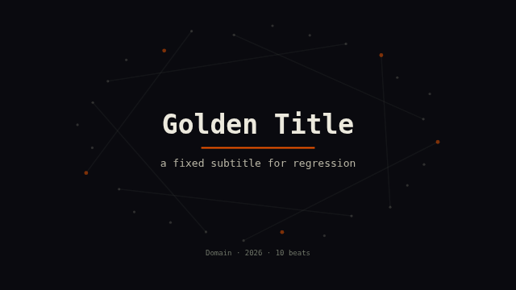
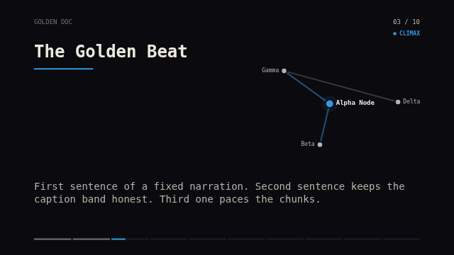
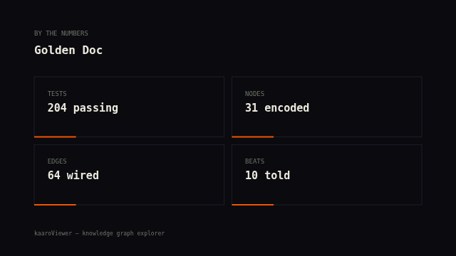

# Cognitive Test Driven Development — kaaro-vid story videos

CTDD for the video surface, in the house format (see root `CTDD.md`):
write what the viewer *should perceive / understand / feel* at each moment
before touching a Scene Script. Each test follows GIVEN → PERCEIVE →
UNDERSTAND → FEEL → FAIL IF.

**What's different here:** every cognitive test is anchored to an embedded
visual artifact and guarded by an automated check.

- **Golden frames** (`goldens/*.png`) — deterministic probe frames per scene,
  compared by SSIM in `vid/visual.test.mjs` on every test run. A scene edit
  that shifts a golden fails CI until the golden is regenerated on purpose
  (`KAARO_UPDATE_GOLDENS=1 npx vitest run vid/visual.test.mjs`) and the image
  diff is reviewed in the PR like any other code change.
- **Contact sheets** (`samples/*.contact.png`, via `pnpm vid contact`) — the
  whole film at a glance, for the pacing/arc tests no single frame can carry.

Automated checks catch *regressions*; the FAIL IF checklists below are the
*review protocol* for intentional changes — walk them against the new
artifacts before regenerating goldens.

---

## CT-V01 · Opening title

**GIVEN** The film opens on the title card (probe: t=2.0 of 4s)

**PERCEIVE**
- A quiet, serious wordmark — bright ink on near-black, mono type
- One accent: the rule under the title; nothing else competes
- A faint constellation ring breathing behind the text, recessive
- Subtitle in secondary ink; provenance line (domain · year · beats · N/E) in muted ink at the bottom

**UNDERSTAND** "This is a produced brief about one subject — and it knows its own shape (10 beats, 31 nodes)."

**FEEL** Settled in. Titles = credibility.

**FAIL IF**
- [ ] The ring outshines the wordmark
- [ ] Subtitle wraps past two lines or collides with the rule
- [ ] Meta line is missing or brighter than the subtitle
- [ ] Any text sits in the accent color

**GUARD** `visual.test.mjs › title-card-settled` (SSIM ≥ 0.97)
**STATUS**: PASSING — golden locked 2026-07-09

---

## CT-V02 · Beat card — the constellation

**GIVEN** A beat card mid-story, constellation settled (probe: t=3.0, climax beat)

**PERCEIVE**
- Left: beat title in bright ink under a kicker row (doc title · position · tension chip)
- Right: the beat's actual subgraph — labeled dots, thin edges, the focus node haloed in the cluster accent
- Edges touching the focus node carry the accent; the rest recede
- Bottom: a segmented progress bar, one segment per beat, current segment filling

**UNDERSTAND**
- "These named things relate — and *this one* is what this beat is about"
- "I am at beat N of M" without counting

**FEEL** Oriented in both the graph and the story. The data is real, not decoration.

**FAIL IF**
- [ ] Node labels collide with each other or cross the graph
- [ ] Identity is color-alone (a node without a legible label)
- [ ] The constellation outshines the title, or vice versa
- [ ] Focus node is not findable in one glance
- [ ] Tension chip is color-only (dot without the word)

**GUARD** `visual.test.mjs › beat-card-constellation` (SSIM ≥ 0.97) + determinism check (same t twice → identical pixels)
**STATUS**: PASSING — golden locked 2026-07-09

---

## CT-V03 · Narration — the caption band

**GIVEN** The same beat card, voiceover speaking, captions pacing (visible in CT-V02's golden: chunk dots + two-line caption)

**PERCEIVE**
- One thought at a time: a 2–3 line caption chunk in body ink, never a wall of text
- Small position dots above the band show which chunk of the narration this is
- Chunks crossfade; nothing types, blinks, or scrolls

**UNDERSTAND** "This line is what the voice is saying right now."

**FEEL** Read *to*, not read *at*. No pressure to speed-read.

**FAIL IF**
- [ ] A caption exceeds three lines or is ellipsized mid-sentence
- [ ] Captions and VO drift so far apart the pairing breaks (>1 chunk off)
- [ ] Chunk dots collide with caption ascenders
- [ ] Caption band overlaps the progress bar

**GUARD** `visual.test.mjs › beat-card-constellation` (band geometry frozen in the golden); VO pacing guarded by `beats.test.mjs` duration tests
**STATUS**: PASSING — golden locked 2026-07-09

---

## CT-V04 · Closing stats

**GIVEN** The film ends on the stats card (probe: t=2.5 of 7s)

**PERCEIVE**
- "BY THE NUMBERS" kicker, then a calm 2×2 grid of stat tiles
- Values in bright ink, labels muted; the accent appears only as a short rule per tile
- Hairline tile borders — a grid, not buttons

**UNDERSTAND** "The brief's headline facts, quantified — this is where the story cashes out."

**FEEL** Concluded. Numbers as a landing, not a dashboard.

**FAIL IF**
- [ ] A value wraps past two lines or overflows its tile
- [ ] Labels brighter than values (inverted hierarchy)
- [ ] Accent used on text instead of the rule
- [ ] More than four tiles (fold into fewer)

**GUARD** `visual.test.mjs › end-card-stats` (SSIM ≥ 0.97)
**STATUS**: PASSING — golden locked 2026-07-09

---

## CT-V05 · The whole film — arc and rhythm

**GIVEN** The full render, reviewed as a contact sheet (`pnpm vid contact <film.mp4>`)

**PERCEIVE**
- Title → beats → stats reads left-to-right as one coherent, dark, typographic system
- Accent colors vary by beat (cluster identity) but the frame never changes its grammar
- The progress bar visibly advances across tiles; constellations differ per beat
- No tile is an accident: every frame could be a poster

**UNDERSTAND** "One system told this story" — not a slideshow of unrelated cards.

**FEEL** The story has a shape. Climax reads hotter (accent tension chip), resolution reads calm.

**FAIL IF**
- [ ] Two adjacent beats are visually indistinguishable (same accent, same layout, same constellation)
- [ ] Any tile shows raw overflow, clipped text, or an empty panel
- [ ] The sheet reads as multiple design systems

**GUARD** verifiers (duration/streams/decode) + golden trace; the sheet itself is regenerated per sample version and reviewed against this checklist
**STATUS**: PASSING — v1 sheet reviewed 2026-07-09

---

## Working protocol

1. **New visual element** → write its CT-V entry first (perceive/understand/feel + FAIL IF), then the Scene Script, then lock a golden.
2. **Changing a look** → update the CT-V entry, make the change, regenerate goldens (`KAARO_UPDATE_GOLDENS=1`), walk the FAIL IF list against the new images, commit code + goldens + doc in one change.
3. **New sample version** → regenerate the contact sheet, review CT-V05, then add the SAMPLES.md entry.
