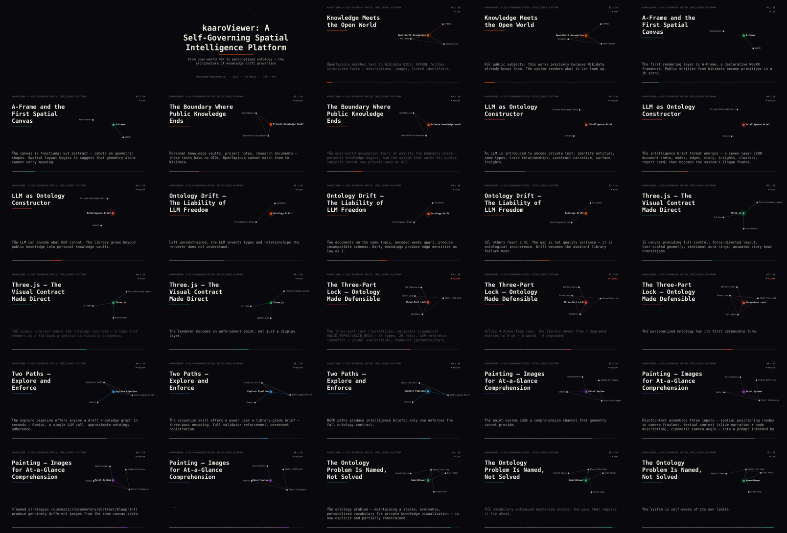

# vid/samples — progression log

Baseline renders checked in to trace how story-video output improves over
time. Each version entry re-renders the **same source** (`library/kaaro-viewer.json`)
so differences are attributable to the pipeline, not the material.

Reproduce the current entry:

```bash
pnpm vid beats kaaro-viewer --narrate --out vid/samples/kaaro-viewer-story.timeline.json
pnpm vid render vid/samples/kaaro-viewer-story.timeline.json --out vid/samples/kaaro-viewer-story.mp4 --trace vid/samples/kaaro-viewer-story.trace.json
pnpm vid verify vid/samples/kaaro-viewer-story.mp4 --timeline vid/samples/kaaro-viewer-story.timeline.json --trace vid/samples/kaaro-viewer-story.trace.json
```

When output quality changes, add a new version entry below (do not rewrite old
ones) and replace the artifacts. The trace's `golden` flag must be true before
an entry is added. **Artifact policy:** the timeline and trace are committed
verbatim; the committed video is `kaaro-viewer-story.preview.mp4`, a compact
640×360 re-encode of the verified full-resolution deliverable (which is
regenerated by the commands above — full renders are too heavy to version).

---

## v1 — 2026-07-09 — narrated constellation cards

**Source:** `library/kaaro-viewer.json` (10 story beats)
**Artifacts:** `kaaro-viewer-story.{timeline.json,preview.mp4,trace.json,contact.png}`



| Metric | Value |
|---|---|
| Deliverable | 1280×720 @ 24fps, h264+aac, 340.8s, 13.9 MB (preview: 640×360, 4.6 MB) |
| Verifiers | 6/6 PASS (trace golden) |
| Render time | ~253s wall (12 generator clips ≈ 219s, audiomix 32s) |
| Encoding | narrated title + constellation beat cards + closing stats card |

**What v1 adds over v0:**

- **Voiceover narration** (espeak-ng): VO synthesized per card, card duration
  driven by *measured* WAV length — the 10s clamp that flattened v0's pacing is
  gone (cards now 21.6–41.7s, matched to their narration).
- **Real graph visuals**: each beat card renders the beat's actual subgraph —
  labeled nodes (focus node haloed in the cluster accent), intra-beat edges
  drawn in with eased stagger, gentle ambient drift.
- **Narration as caption band**: paced sentence chunks with position dots, no
  more ellipsized walls of text.
- **Closing stats card**: the brief's key stats as staggered 2×2 stat tiles.
- **Design pass**: 7-hue accent palette validated for lightness band, chroma,
  CVD separation, and contrast on the dark surface; ink-token typography
  hierarchy; segmented per-beat progress bar; eased, deterministic motion.

**Known gaps / improvement axes:**

1. **Voice quality** — espeak-ng is robotic. The provider layer already
   prefers piper (neural) when `KAARO_PIPER_VOICE` points at a model; this
   environment's network policy blocked the model download. Fetch a voice
   locally (`python3 -m piper.download_voices en_US-lessac-medium`) and
   re-render for an immediate leap.
2. **Caption/VO alignment** — captions pace linearly across the card; word- or
   sentence-level alignment to the VO would tighten them.
3. **Music/atmosphere** — per-card drones only; no continuous score or
   tension arc across the piece.
4. **Transitions** — hard cuts; no crossfade vocabulary in the Timeline yet.
5. **3D canvas renders** — constellations are 2D re-layouts; rendering the
   actual Three.js scene per beat (canonical camera) is the v2+ axis.

---

## v0 — 2026-07-08 — beat cards baseline

**Source:** `library/kaaro-viewer.json` (10 story beats)
**Artifacts:** `kaaro-viewer-story.{timeline.json,mp4,trace.json}`

| Metric | Value |
|---|---|
| Deliverable | 640×360 @ 24fps, h264+aac, 102.1s, 2.3 MB |
| Verifiers | 6/6 PASS (trace golden) |
| Render time | ~46s wall (11 generator clips ≈ 3.5s each + 10s cold-start, concat 0.3s) |
| Encoding | opening title card + one beat card per story beat |

**What v0 does:** typographic beat cards — beat index, title, line-revealed
narration, tension badge, cluster-colored accents and drifting node field,
tension-pitched Web Audio drone (low 165Hz → climax 330Hz). Beat length scales
with narration size (4–10s @ 30 chars/s).

**Known gaps / improvement axes (in rough priority order):**

1. **Narration audio** — text-on-screen only; no voiceover. Next: TTS track on
   an audio lane, beat durations driven by VO length instead of reading rate.
2. **Real graph visuals** — cards show no actual graph. Next: render the
   Three.js scene per beat (camera at each beat's canonical position, reusing
   `getCanonicalCamera` from `canvas/scene-painter.mjs`) as the card backdrop.
3. **Clamped pacing** — 8 of 10 beats hit the 10s max clamp, flattening rhythm;
   narration longer than the card is ellipsized (`…`).
4. **No transitions** — hard cuts between cards; no crossfade/dip-to-black
   vocabulary in the Timeline yet.
5. **Audio continuity** — per-clip drones reset at each cut; no continuous bed
   or tension arc across the whole piece.
